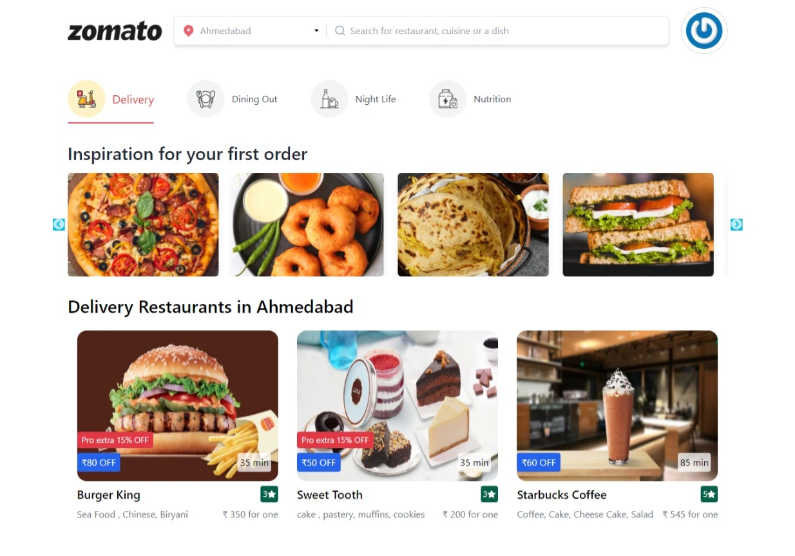
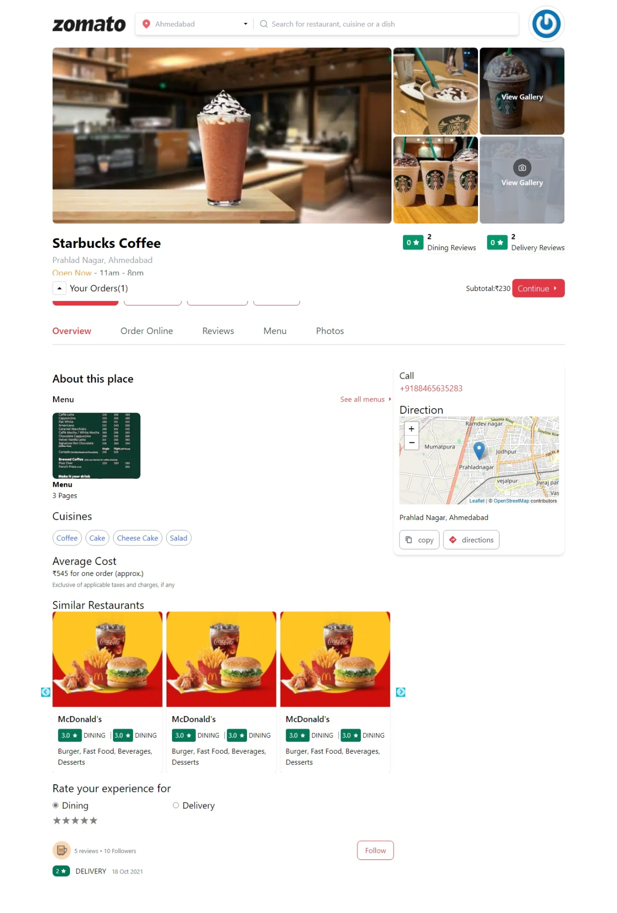
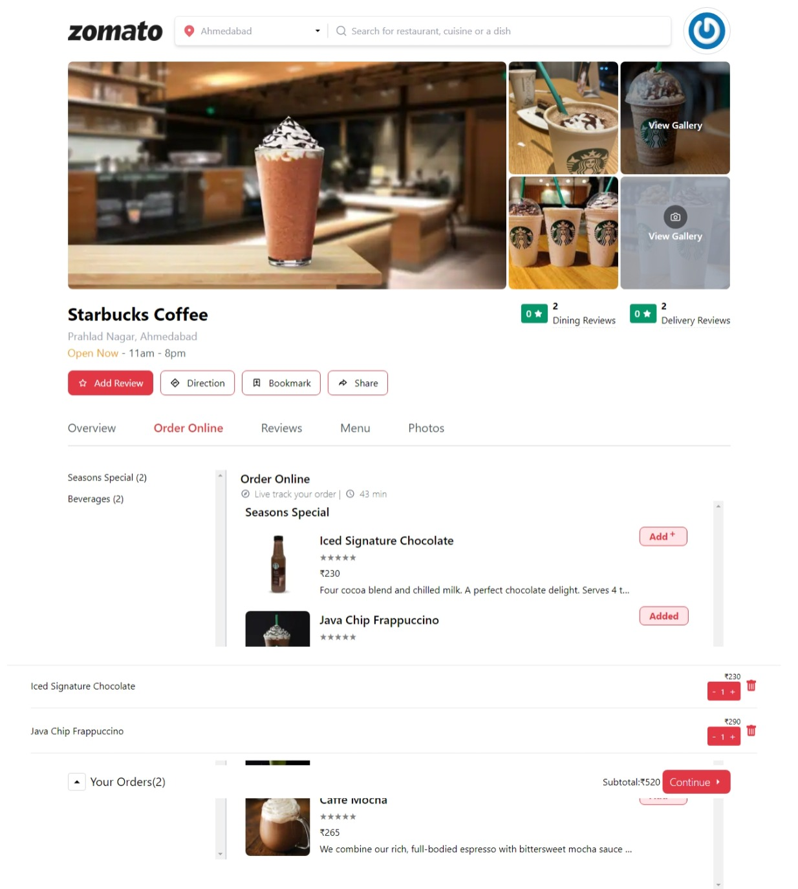
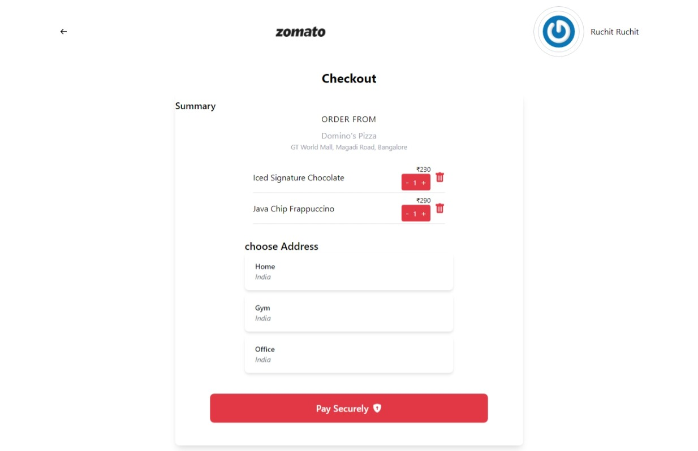

# master-project

This is Food Delivery website programmed in ReactJS and javascript.

Modules used-

  - docker
  - travisci
  - nginx
  - razonpay
  - leafmap
  
  Users will use this website to order food from their favourite restaurants.
  1. users will get a good deals and discounts.
  2. home delivery / selfpickup available.
  3. easy to get food from any restaurnts.
  4. can also be used to book your choice table for the special occasion.
  5. secure payment done with razonpay.
  6. also users can order medicines from it by using Nutritions tab.
  
  # screensort
    
    
    
    
    
    

  